# Software Design Documentation
## Parcel-Safe Smart Top Box System

---

## 1. Use Case Diagrams

### 1.1 Customer Use Case Diagram

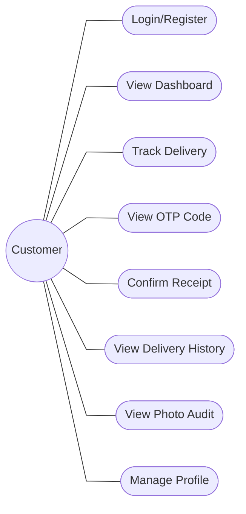

### 1.2 Rider Use Case Diagram

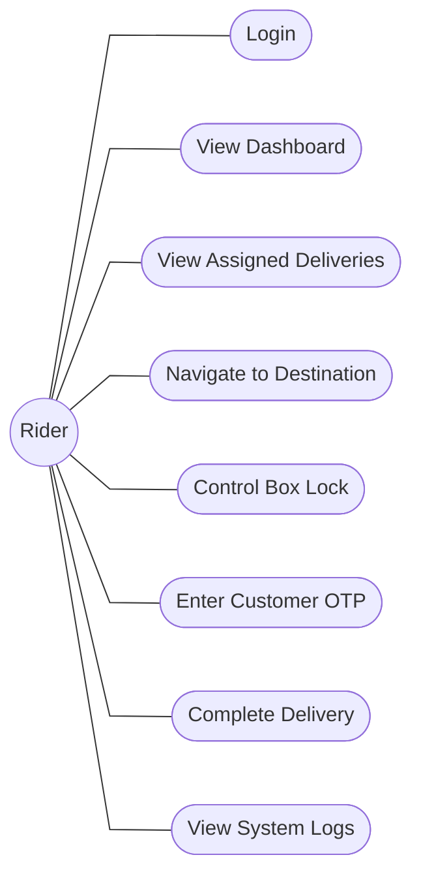

---

## 2. UI Software Workflow

### 2.1 Customer App Workflow

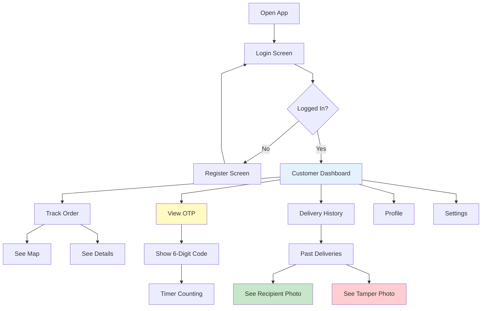

### 2.2 Rider App Workflow

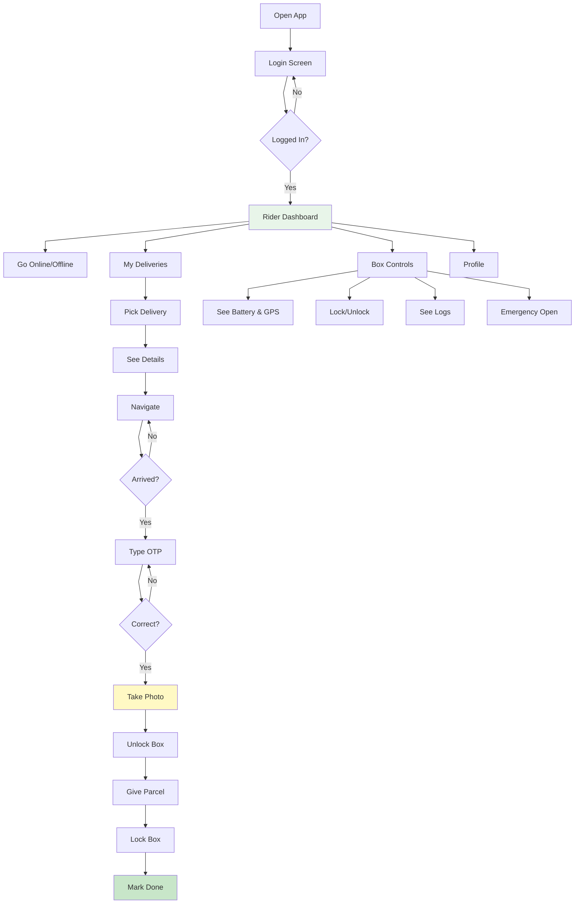

---

## 3. System Pipeline Diagrams

### 3.1 Customer App Pipeline

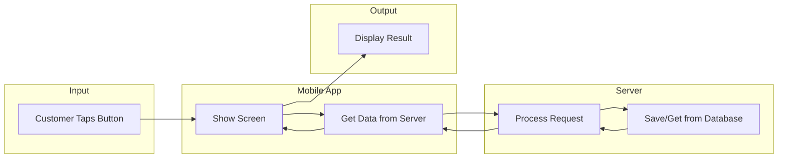

### 3.2 Rider App Pipeline

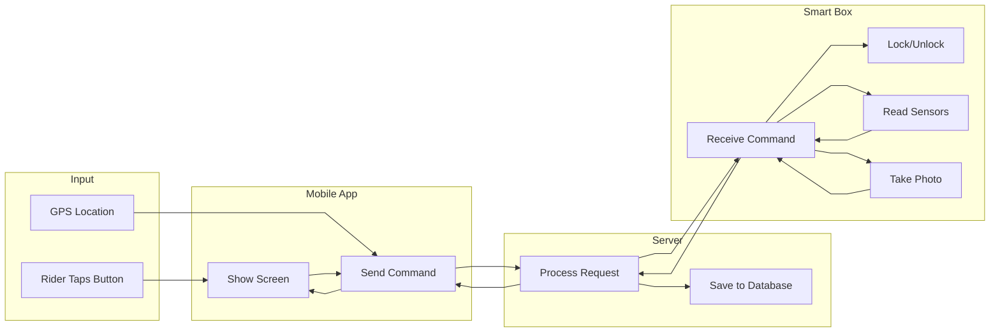

### 3.3 Delivery Process Pipeline

```mermaid
%%{init: {'flowchart': {'curve': 'linear'}}}%%
flowchart LR
    subgraph "Step 1"
        A[Order Placed]
    end
    
    subgraph "Step 2"
        B[Assign Rider]
        C[Pickup Parcel]
        D[Lock Box]
    end
    
    subgraph "Step 3"
        E[Deliver]
        F[Track Location]
    end
    
    subgraph "Step 4"
        G[Arrive]
        H[Show OTP]
    end
    
    subgraph "Step 5"
        I[Enter OTP]
        J[Take Photo]
        K[Unlock Box]
        L[Give Parcel]
    end
    
    subgraph "Step 6"
        M[Done]
    end
    
    A --> B
    B --> C
    C --> D
    D --> E
    E --> F
    F --> G
    G --> H
    H --> I
    I --> J
    J --> K
    K --> L
    L --> M
```

### 3.4 Photo Capture Pipeline

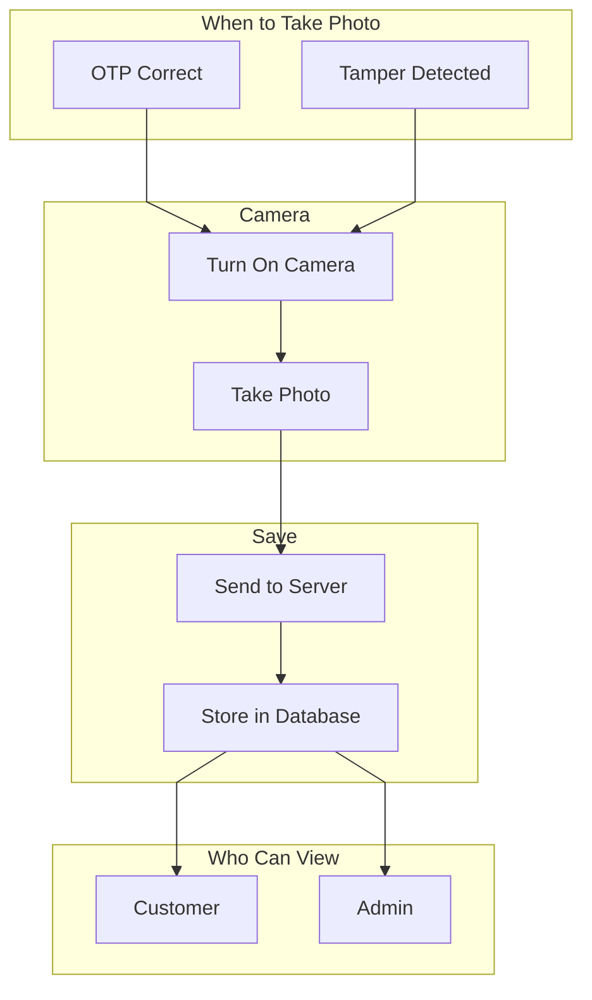

---

## 4. Detailed Flowcharts

### 4.1 Customer Tracking Flowchart

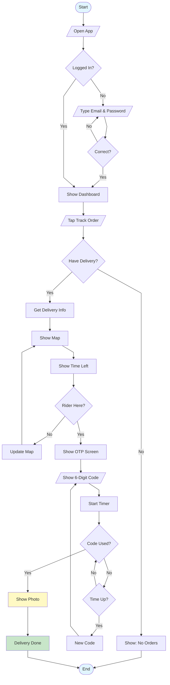

### 4.2 Rider Delivery Flowchart

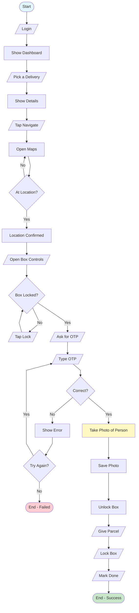

### 4.3 OTP Verification Flowchart

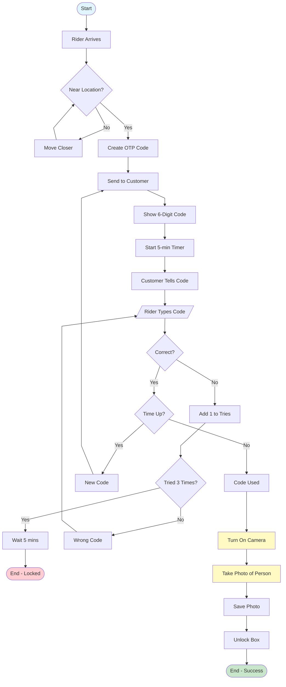

### 4.4 Tamper Detection Flowchart

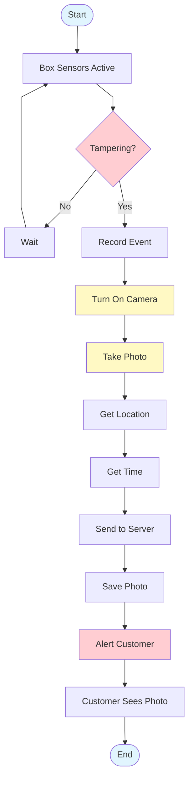

### 4.5 Box Control Flowchart

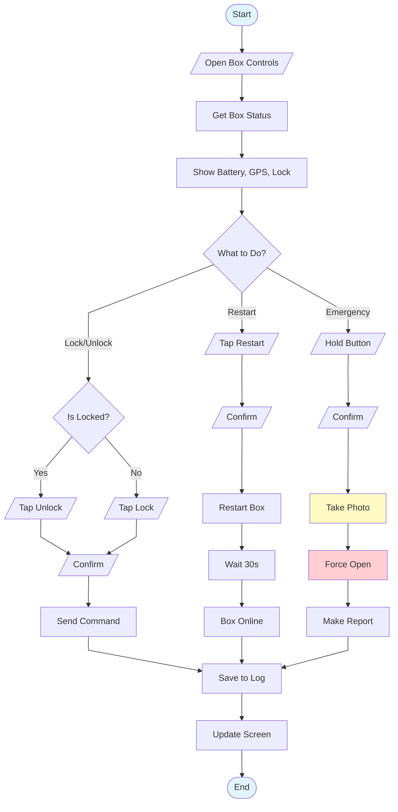

### 4.6 Login Flowchart

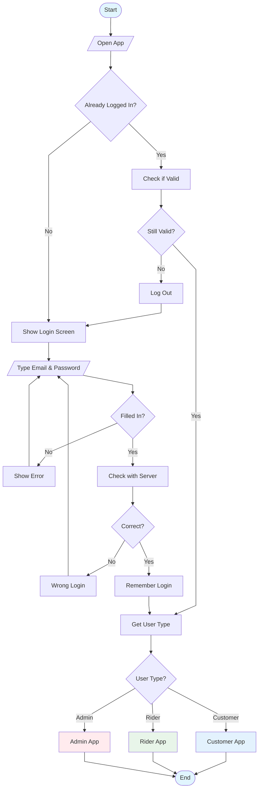

### 4.7 Full Delivery Flow

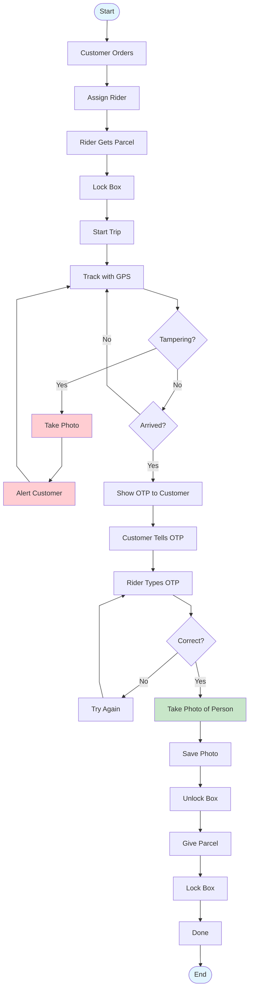

---

## Flowchart Shape Legend

| Shape | Syntax | Meaning |
|-------|--------|---------|
| Oval | `([Text])` | Start / End |
| Rectangle | `[Text]` | Process |
| Diamond | `{Text}` | Decision |
| Parallelogram | `[/Text/]` | Input / Output |
| Cylinder | `[(Text)]` | Database |
| Circle | `((Text))` | Actor |
| Stadium | `(["Text"])` | Use Case |

---

## Photo Capture Summary

| Event | Trigger | Purpose |
|-------|---------|---------|
| Recipient Photo | OTP Verified Successfully | Proof of delivery to correct person |
| Tamper Photo | Sensor Detects Anomaly | Evidence of tampering attempt |
| Emergency Photo | Force Open Activated | Document emergency access |

---

## Usage Instructions

1. Go to [https://mermaid.live](https://mermaid.live)
2. Copy code between \`\`\`mermaid and \`\`\`
3. Paste into editor
4. Export as PNG or SVG

---

## 8. Data Management Design

### 8.1 Data Flow Diagram (DFD)

The Data Flow Diagram illustrates the movement of data through the Parcel-Safe system, showing how information flows between external entities, processes, and data stores.

**See:** `diagrams/16-data-flow-diagram.drawio`

#### Data Value Chain

| Phase | Description | Data Elements |
|-------|-------------|---------------|
| **Source** | Data originates from users (mobile apps), IoT hardware (sensors, GPS, camera), and external services | User credentials, location coordinates, sensor readings, photos |
| **Collection** | Mobile apps and IoT devices transmit data via HTTPS/MQTT | Real-time telemetry, OTP requests, delivery updates |
| **Storage** | Firebase Firestore (NoSQL) and Cloud Storage | User profiles, delivery records, photos, logs |
| **Processing** | Cloud Functions handle OTP generation, notifications, analytics | Verification logic, alert triggers, report generation |
| **Analysis** | Admin dashboard displays aggregated insights | Delivery metrics, tamper patterns, system health |

#### Key Data Flows

1. **Authentication Flow**: User → Auth Process → User Data Store
2. **Delivery Management Flow**: Customer/Rider → Delivery Process → Delivery Data Store
3. **OTP Flow**: Customer Request → OTP Generation → OTP Store → Rider Verification → Box Control
4. **Tracking Flow**: GPS Service → Tracking Process → Location Data Store → Customer App
5. **Tamper Detection Flow**: Smart Box Sensors → Tamper Process → Alert Store → Admin Notification

---

### 8.2 Entity Relationship Diagram (ERD)

The ERD shows the database schema design for the Parcel-Safe system using Firebase Firestore (NoSQL).

**See:** `diagrams/17-entity-relationship-diagram.drawio`

#### Entity Summary

| Entity | Description | Key Attributes |
|--------|-------------|----------------|
| **USER** | System users (customers, riders, admins) | user_id, email, role, phone |
| **SMART_BOX** | Physical IoT box devices | box_id, owner_id, is_locked, telemetry |
| **DELIVERY** | Parcel delivery records | delivery_id, tracking_number, status, addresses |
| **OTP** | One-time passwords for verification | otp_id, code, expires_at, is_used |
| **PHOTO_AUDIT** | Captured photos for proof/audit | photo_id, image_url, photo_type |
| **TAMPER_ALERT** | Security breach notifications | alert_id, alert_type, severity |
| **LOCATION_LOG** | Real-time tracking history | log_id, latitude, longitude, timestamp |
| **BOX_EVENT_LOG** | Box control events | event_id, event_type, source |
| **NOTIFICATION** | Push notification records | notification_id, title, is_read |

#### Key Relationships

- USER (1) → (N) DELIVERY (customer receives, rider delivers)
- USER (1) → (N) SMART_BOX (owner)
- DELIVERY (1) → (N) OTP
- DELIVERY (1) → (N) PHOTO_AUDIT
- DELIVERY (1) → (N) LOCATION_LOG
- SMART_BOX (1) → (N) TAMPER_ALERT
- SMART_BOX (1) → (N) BOX_EVENT_LOG

---

### 8.3 Network Diagram

The Network Diagram shows the system architecture including all network zones, devices, and communication protocols.

**See:** `diagrams/18-network-diagram.drawio`

#### Network Zones

| Zone | Components | Purpose |
|------|------------|---------|
| **User Zone** | Customer Mobile, Rider Mobile, Admin Tablet/Web | Client applications |
| **Internet** | Public network with HTTPS/WSS protocols | Secure data transmission |
| **Cloud Services Zone** | Firebase Auth, Firestore, Storage, Functions, FCM, Maps API | Backend services |
| **IoT Edge Zone** | ESP32 MCU, Servo Lock, GPS, Camera, Sensors, GSM Module | Hardware components |

#### Communication Protocols

| Protocol | Port | Usage |
|----------|------|-------|
| HTTPS | 443 | REST API calls, Web traffic |
| WSS | 443 | Real-time WebSocket connections |
| MQTT | 8883 | IoT device communication |
| GSM/GPRS | N/A | Cellular backup for IoT |

#### Security Measures

- **TLS 1.3** encryption for all network traffic
- **OAuth 2.0** with Firebase Authentication
- **JWT tokens** for session management
- **End-to-end encryption** for sensitive data
- **Certificate pinning** in mobile apps

---

## Draw.io Diagram Files

| # | Diagram | File |
|---|---------|------|
| 16 | Data Flow Diagram | `16-data-flow-diagram.drawio` |
| 17 | Entity Relationship Diagram | `17-entity-relationship-diagram.drawio` |
| 18 | Network Diagram | `18-network-diagram.drawio` |

---

**Project:** Parcel-Safe Smart Top Box  
**Author:** Lorenzo Bela  
**Date:** December 2024
